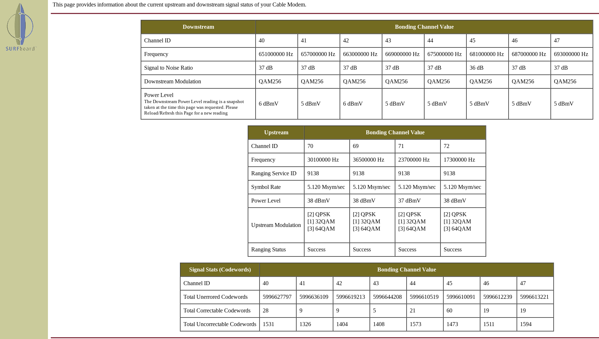
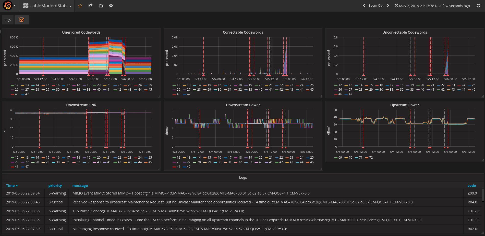

# cableModemStats
Turn this.  
  
Into this.  
  
It is not always possible to gather metrics from a cable modem using SNMP. This project scrapes metrics and logs from the modem web interface. It uses curl, pup, jq, influxdb, grafana and cron. I run this on a Raspberry Pi to collect metrics from a Motorola SB6141.

1. Install influxdb and `influx -execute 'create database cableModemStats'`. I highly recommend getting a [fresh version](https://portal.influxdata.com/downloads/), since the package manager version can be quite stale.
2. Install curl, jq and [pup](https://github.com/ericchiang/pup).
3. Adjust the [prefs](prefs) and create a [cron](extra/cron) for data collection. 
4. Install grafana and add an influx data source named `cableModemStats`. Once again, I recommend getting a [fresh version](https://grafana.com/grafana/download).
5. Create a [dashboard](extra/dashboard.json).
